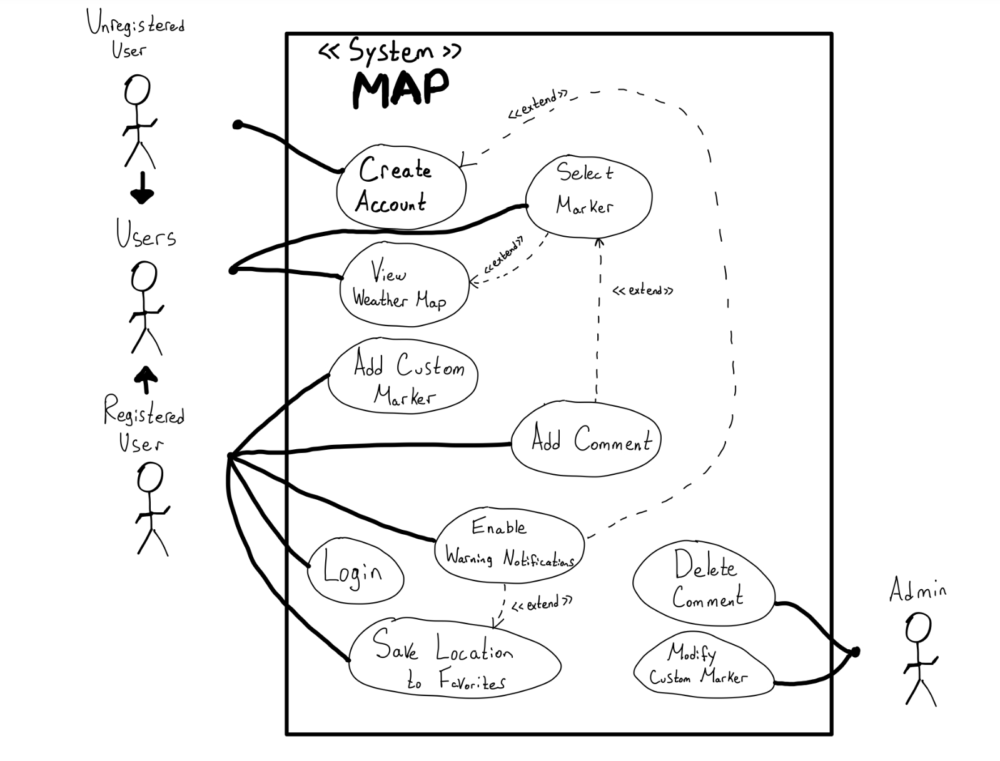
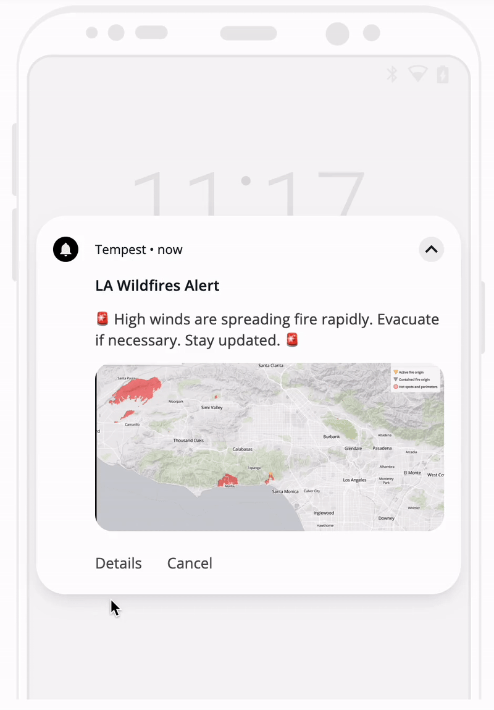
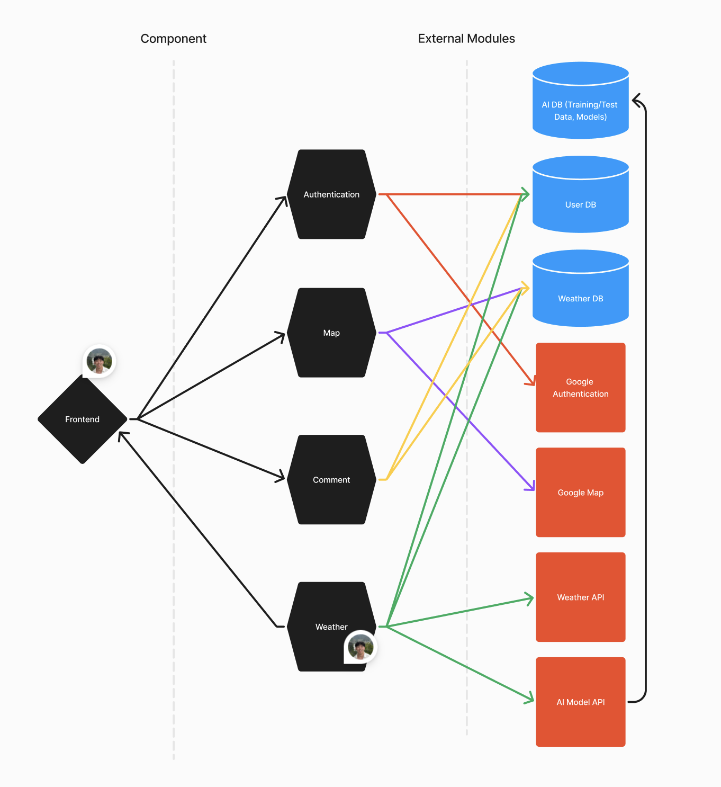
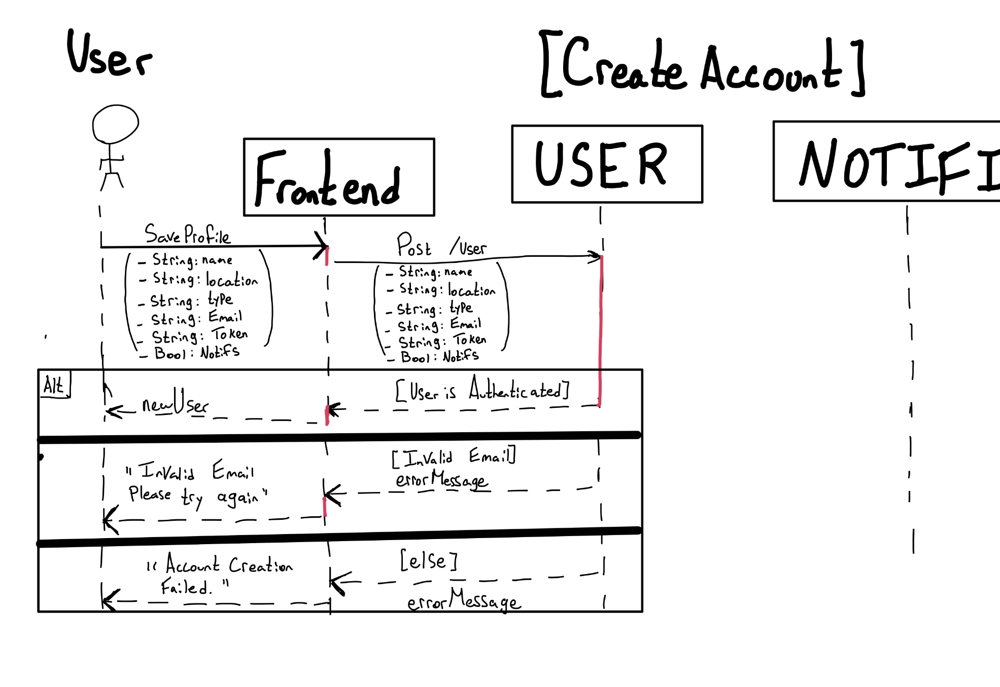
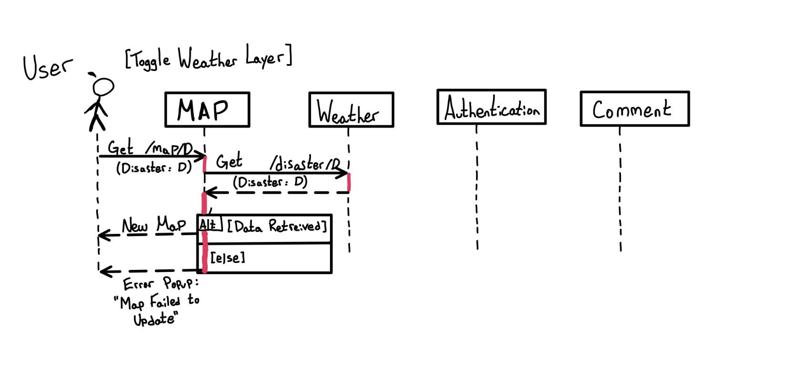

# M3 - Requirements and Design

## 1. Change History

- **Removed AI predictive pathing feature**: Replaced with a "danger score" algorithm that calculates the danger between a weather event and the user's current location.
- **Added custom markers**: Users can now add custom markers for safehouses, resource points, and dangers.
- **Added saved locations**: Users can save important locations for easy tracking.
- **Updated Actors Description**: Removed references to predictive weather pathing and updated descriptions to reflect new features.
- **Updated Functional Requirements**: Removed predictive weather pathing and added requirements for custom markers, danger scores, and saved locations.
- **Updated Main Project Complexity Design**: Replaced wildfire path prediction with danger score calculation.


## 2. Project Description

**Tempest** is a reimagined weather and news application designed to prioritize critical information about natural disasters, such as wildfires, earthquakes, hurricanes, and other intense weather.
The app delivers real-time updates and localized alerts for users to stay informed and prepared in the face of extreme weather events.

## 3. Requirements Specification

### **3.1. Use-Case Diagram**



### **3.2. Actors Description**

1. **[Basic User]**: Basic Users can interact with the map to get information about the weather conditions in their area. These users can also view weather event markers, read comments, and become Authenticated Users.
2. **[Authenticated User]**: Authenticated Users can interact with the app with all the same privileges as an Basic User, but can also enable push notifications, create comments, add custom markers (e.g., safehouses, resource points, dangers), and save locations.
3. **[Admin]**: Admins have the capacity to manage comments by removing or modifying unwanted comments, as well as manually modifying weather events.

### **3.3. Functional Requirements**

<a name="fr1"></a>

   - **Overview**:
      1. **Create Account**
      2. **Select Weather Event**
      3. **Add Custom Marker**
      4. **Add Comment**
      5. **Save Location to Favorites**
      6. **Enable Warning Notifications**

1. **Create Account**
      - **Description**: Basic Users can create an account using their email or social media accounts (e.g., Google, Facebook). Once authenticated, they become Authenticated Users.
      - **Primary actor(s)**: Basic Users
      - **Main success scenario**:
         1. User clicks on the "Sign Up" button.
         2. User selects an authentication method (email, Google, or Facebook).
         3. User provides necessary information (e.g., email, password, or social media credentials).
         4. System validates the information and creates an account.
         5. User is redirected to the app's main interface as an Authenticated User.
      - **Failure scenario(s)**:
         - 3a. User provides invalid email or password.
            - 3a1. System displays an error message: "Invalid email or password. Please try again."
            - 3a2. User is prompted to re-enter credentials.
         - 3b. Social media authentication fails.
            - 3b1. System displays an error message: "Authentication failed. Please try again or use another method."
            - 3b2. User is redirected to the authentication selection screen.
         - 4a. System fails to create an account.
            - 4a1. System displays an error message: "Account creation failed. Please try again later."
            - 4a2. User is returned to the sign-up screen.
2. **[Select Weather Event]**:
   - **Description**:All Users (Basic and Authenticated) can click on weather event markers on the map to view detailed information about the event, including the danger score.
   - **Primary actor(s)**: Basic Users, Authenticated Users
   - **Main success scenario**:
     1. User clicks on a weather event marker on the map.
     2. System displays a pop-up with event details (e.g., type, location, danger score).
     3. User can close the pop-up by clicking outside it or a "Close" button.
   - **Failure scenario(s)**:
     - 1a. Danger score calculation fails.
       - 2a1. System displays a placeholder message: "Danger score unavailable."
       - 2a2. Event details are displayed without the danger score.
3. **[Add Custom Marker]**:
   - **Description**: Authenticated Users can add custom markers to the map for safehouses, resource points, or dangers. These markers are visible to all users.
   - **Primary actor(s)**: Authenticated Users
   - **Main success scenario**:
     1. User clicks the "Add Marker" button.
     2. User selects a marker type (safehouse, resource point, danger).
     3. User places the marker on the map.
     4. System saves the marker and displays it on the map.
   - **Failure scenario(s)**:
     - 1a. User is not authenticated.
        - 1a1. System displays an error message: "You must be logged in to add markers."
        - 1a2. User is redirected to the login screen.
4. **[Add Comment]**:
   - **Description**:Authenticated Users can add comments to weather events to share important information about the public events. 
   - **Primary actor(s)**: Authenticated Users
   - **Main success scenario**:
     1. User clicks on a weather event marker.
     2. User fills in the comment field
     3. User types a comment in the text box and clicks "Submit."
     4. System saves the comment and displays it under the event details.
   - **Failure scenario(s)**:
     - 2a. User is not authenticated.
       - 2a1. System displays an error message: "You must be logged in to add comments."
       - 2a2. User is redirected to the login screen.
     - 3a. Comment contains offensive language.
       - 3a1. System displays an error message: "Comment contains inappropriate content. Please revise."
       - 3a2. User is prompted to edit the comment.
5. **[Save Location to Favorites]**:
   - **Description**: Authenticated Users can save specific locations on the map to their "Favorites" list for easy access later. "Favorites" can also be used to receive notifications in case of danger.
   - **Primary actor(s)**: Authenticated Users
   - **Main success scenario**:
     1. User clicks on a location on the map.
     2. User clicks the "Save to Favorites" button.
     3. System saves the location to the user's Favorites list.
     4. User receives a confirmation message: "Location saved to Favorites."
   - **Failure scenario(s)**:
     - 2a. User is not authenticated.
       - 2a1. System displays an error message: "You must be logged in to save locations."
       - 2a2. User is redirected to the login screen.
     - 3a. Location save fails.
         - 3a1. System displays an error message: "Failed to save location. Please try again later."
         - 3a2. User is prompted to retry the action.
6. **[Enable Warning Notifications]**:
   - **Description**: Authenticated Users can enable push notifications to receive alerts about extreme weather events in their area.
   - **Primary actor(s)**: Authenticated Users
   - **Main success scenario**:
     1. User navigates to the "Settings" menu.
     2. User toggles the "Enable Notifications" switch.
     3. System prompts the user to enable location services.
     4. User enables location services and push notifications.
     5. System registers the user for notifications and confirms: "Notifications enabled."

   - **Failure scenario(s)**:
     - 3a. User declines to enable location services.
         - 3a1. System displays an error message: "Location services are required for notifications."
         - 3a2. User is prompted to enable location services in their device settings.
     - 4a. User declines to enable push notifications.
         - 4a1. System displays an error message: "Push notifications are required for alerts."
         - 4a2. User is prompted to enable push notifications in their device settings.


7. **[Admins can manage weather pings]**:

   - **Description**: Admins have the capacity to edit and manually change weather event pings
   - **Main success scenario**:

     1. Admin clicks on extreme weather event ping
     2. Admin can choose to modify location, description, support information, etc.
     3. Admin edits respective section
     4. Admin confirms edits and the weather ping is updated for all users

   - **Failure scenario(s)**:
      - 4a. Admin attempts to enter an empty edit
         - 4a1. Error is returned, displaying the text "Edits must not be empty, please enter content"
         - 4a2. Edits are not updated for all users, and the Admin can continue to edit.
      - 4b. Failure to confirm edits
         - 4b1. An error is returned saying "Failed to edit {section}, please try again soon."
         - 4b2. Error is logged to manually review

### **3.4. Screen Mockups**

1. **App Icon**


2. **Push Notification Mockup**


_push notification with static map concept._


_push notification with dynamic map concept._

### **3.5. Non-Functional Requirements**

<a name="nfr1"></a>

1. **[Accessibility Compliance]**
   - **Description**:The app must comply with WCAG 2.1 Level AA accessibility standards, ensuring it is usable by individuals with disabilities (e.g., screen reader compatibility, color contrast, keyboard navigation).
   - **Justification**: WCAG 2.1 Level AA is a globally recognized standard for accessibility. Compliance ensures the app is inclusive and usable by individuals with disabilities, such as visual impairments or motor disabilities. This is critical for ensuring equitable access to life-saving weather information. [usability, inclusivity]
2. **[User Privacy]**
   - **Description**: The app must encrypt all user data (e.g., account information, saved locations) both in transit and at rest, and comply with GDPR and CCPA regulations.
   - **Justification**: Users trust the app with sensitive information, and robust security measures are necessary to protect their privacy and comply with legal requirements. [security, compliance]
3. **[Ease of Use]**
   - **Description**: The app must gracefully handle errors (e.g., network failures, server downtime) and provide users with clear instructions for recovery (e.g., retry options, offline mode).
   - **Justification**: The ISO 25010 Standard for Software Quality highlights the importance of error handling and recovery in ensuring system reliability. Clear error messages and recovery options reduce user frustration and ensure the app remains usable even during failures. [usability, reliability]

## 4. Designs Specification

### **4.1. Main Components**

1. **Authentication**

   - **Purpose**: The authentication component authenticates a user with their Google or Facebook accounts allowing them to become an “Authenticated User” actor in the app.
   - **Rationale**: This component in the application is used to create an identity for a user allowing them interact with social features and receive personalized integration
   - **Interfaces**:
     1. UserSession exchangeAuthorizationCode(String authorizationCode, String redirectUri);
        - **Purpose**: Exchanges the provided authorization code for access and ID tokens creating a user session
     2. boolean validateIdToken(String idToken);
        - **Purpose**: Validate the IdToken of the user
     3. String refreshAccessToken(String refreshToken);
        - **Purpose**: Refresh the access token
     4. void logoutUser(String userId);
        - **Purpose**: Logout a user using the userId

2. **Map**

   - **Purpose**: The map component displays extreme weather conditions globally where users can view, comment, and learn about resources on individual weather disasters
   - **Rationale**: This component is necessary to provide a visual interface for users to access accessible weather information. A map-based UI is more engaging and intuitive for users.
   - **Interfaces**:
     1. List<WeatherEvent> getExtremeWeatherEvents(Double latitude, Double longitude);
        - **Purpose**: Retrieves a list of extreme weather events based on location
     2. List<WeatherEvent> getMapExtremeWeatherEvents();
        - **Purpose**: Get all global extreme weather events to display on the map
     3. WeatherEventDetails getEventDetails(String eventId);
        - **Purpose**: Get individual event information from the database such as comments

3. **Comment**

   - **Purpose**: The comment component interact closely with the map component to allow comments to populate on the map and provide functionality to make and remove remarks.
   - **Rationale**: This component is necessary to provide users and admins with the ability to manage their own and all user's comments, respectively. By decoupling this from the Map component, it is easier to debug and manage commnets with a separate component
   - **Interfaces**:
     1. void postComment(String eventId, String userId, String comment);
        - **Purpose**: Post comment from a user on specific event
     2. List<Comment> getEventComments(String eventId);
        - **Purpose**: List specific comments of an event
     3. void removeEventComments(List<UUID> commentId);
        - **Purpose**: Remove all or an individual event commnets

4. **Weather**
   - **Purpose**: Backend component to update the weather database with predictive and AI weather capabilities. The component will call the weather API endpoint periodically retrieving the data so every user sees the same weather information. The component will also notify users of local extreme weather conditions through their communication method of choice
   - **Rationale**: The weather component is used to act as a central consolidation of weather information rather than having the frontend call the API for every user. This mitigates the number of API calls while creating a source of truth for weather information for all users. This gives flexibility of scalability and rate limiting the number of API calls.
   - **Interfaces**:
     1. void fitModel (Weather weatherInformation):
        - **Purpose**: Leverage the existing model and training data to fit the current weather predicting where the wildfire will be
     2. void updateWeatherDB (Weather weatherInformation):
        - **Purpose**: Update the Weather DB with the most recent weather information
     3. void notifyUser (String eventId, String userId):
        - **Purpose**: Notify a user with a specific event
     4. List<Users> checkLocalUsers (String eventId):
        - **Purpose**: Return a list of Users that is affect by the specified event

### **4.2. Databases**

**Technologies**

1. **File Based Storage (S3)**
   - **Purpose**: Store sterilized and filtered training data
2. **NoSQL (Dynamo DB)**
   - **Purpose**: Store user information, weather, comments, notifications and other application data

**Database Schemas**

1. **AI DB**
   - **Purpose**: Used to store training, test, and validation test split, as well as the model to fit future data
2. **Weather DB**
   - **Purpose**: Storing all extreme weather information to populate the map including comments
3. **User DB**
   - **Purpose**: Store the username, name, role, email

### **4.3. External Modules**

1. **[Google Maps](https://developers.google.com/maps)**
   - **Purpose**: Display map data for the app
2. **[Google Authentication](https://developer.android.com/identity/sign-in/credential-manager-siwg)**
   - **Purpose**: Handle Sign In with Google
3. **[NASA Fire Information for Resource Management System](https://firms.modaps.eosdis.nasa.gov/api/)**
   - **Purpose**: Collect wild fire information from NASA
4. **[Open Weather](https://openweathermap.org/api)**
   - **Purpose**: Provides weather meta data
5. **[AWS Lambda](https://aws.amazon.com/lambda/)**
   - **Purpose**: Used to build serverless functions and pipelines to access certain modules/APIs
6. **[AWS API Gateway](https://aws.amazon.com/api-gateway/)**
   - **Purpose**: Used to create HTTPS API methods for frontend access
7. **[Firebase Console](https://console.firebase.google.com/)**
   - **Purpose**: Used to implement push notifications

### **4.4. Frameworks**

1. **[AWS]**
   - **Purpose**: Our cloud service provider will host the database, file storage, and backend
   - **Reason**: We feel comfortable with AWS due to past industry experience working with AWS
2. **[Express.js]**
   - **Purpose**: Our backend framework for APIs, authorization, and request handling
   - **Reason**: Due to our past experience and industry standard working with Express.js

### **4.5. Dependencies Diagram**



### **4.6. Functional Requirements Sequence Diagram**

1. [**Create User Account**](#fr1)
   
2. [**User can Toggle between different Weather Events**](#fr1)
   
3. [**User can comment on specific Weather Event**](#fr1)
   
4. [**User can enable Weather Predictions**](#fr1)
   
5. [**Admin can Delete Comment**](#fr1)
   
6. [**Users can Enable Push notifications**](#fr1)
   

### **4.7. Non-Functional Requirements Design**

1. [**[Notification Speed]**](#nfr1)
   - **Validation**: We plan to use an event-driven architecture, where new incoming data will trigger a notification system. Additionally, we plan to scale the size and number of our servers to match demand.
2. [**[User Privacy]**](#nfr1)
   - **Validation**: No information except for the User's nickname will ever be exposed to anyone other than the user. No other Users will be able to view or access this information at any time.
3. [**[Ease of Use]**](#nfr1)
   - **Validation**: The app will open to the map, and from there any map ping can be clicked and all relevant information will be displayed. There will be no need to sign in or click anywhere else in order to view data on an extreme weather event.

### **4.8. Main Project Complexity Design**

**Wildfire path prediction**

- **Description**: Based on current wildfire data and location, we will attempt to compute the path of the wildfire data in the future.
- **Why complex?**: It's complex because this will involve highly advanced algorithms to predict fire line trajectory based on metadata (like wind direction, speed, etc.). It may also involve training a model to enhance prediction.
- **Design**:
  - **Input**: Current fire location, wind direction and speed
  - **Output**: Predicted direction of disaster
  - **Main computational logic (Pseudo Code)**: 
  ```
  for number_of_predictions:
      predicted_path <- wind_speed[fire_location] + wind_intensity[fire_location]
  ```
  This is a simple example of pseudo-code, but this algorithm will have to take in many other factors. This includes the shrubbery surrounding the area of the wildfire, changes in altitude and slopes, current temperature and humidity, regional firefighting resources, and more. We also plan to train and use an artifical intelligence model to more accurately predict disaster pathing.

## 5. Contributions

- Tareq Alansari: App design mockups (figma, onesignal, photoshop). Assisted in reviewing sections, and contributing to various sections.
- Martin Tang: Designed the architecture and design for the product (4.1 - 4.5). Completed the M3_Reflections along with assigning and delegating weekly tasks for the team. In addition, explored external modules and APIs to leverage within the product.
- Miguel Menard: Project Description, Use Case Diagram, Functional Requirements 2-6,  Sequence Diagrams 1-6, Help in Non-Functional Requirements. 
- Armaan Braich: Wrote non-functional requirements and design. Assisted in writing main project complexity design, as well as determining key actors and use cases. Additionally wrote some of the functional requirements and flows. Helped to fix grammar issues.
